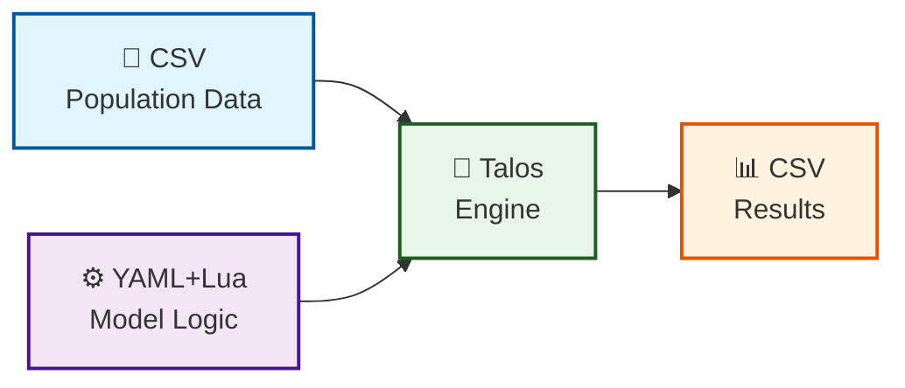

<div align="left">
  
  <p><em>Talos — Migration Microsimulation Engine</em></p>
</div>

# Talos
## Migration Microsimulation Engine

A fully self-contained, dynamically configurable demographic microsimulation system written in Go. **Talos is specifically designed as a migration microsimulation model** that simulates population movement between geographic areas while also handling other demographic processes like aging and mortality.

---

## How Talos Works: Our Approach

### The Problem We're Solving

Traditional microsimulation systems have a fundamental problem: **to change how the model behaves, you need to change the source code and recompile.** This means:
- Only programmers can modify models
- Each change requires a new software release
- Models are locked inside compiled binaries
- Collaboration is difficult

### Our Solution: Models as Data

Talos takes a different approach. **Models are defined as data, not code.** Here's how:



### What This Means for You

| Traditional Approach | Talos Approach |
|----------------------|----------------|
| Model is code | Model is data (YAML + Lua) |
| Change = recompile | Change = edit text file |
| Programmers only | Anyone can modify |
| One model per release | Many models in one binary |
| Models are hidden | Models are transparent |
| Hard to share | Easy to share |

### The Three Components

**1. CSV Files: Your Population Data**

Your population is stored as a simple CSV file. Each row is one person, each column is a characteristic (age, sex, area, etc.). Talos automatically detects your columns - no configuration needed!

**2. YAML + Lua: Your Model Instructions**

Your model is defined in a YAML file with embedded Lua scripts:
- **YAML** configures the simulation (iterations, file paths, etc.)
- **Lua** defines the logic (how people age, die, move, etc.)

The Lua scripts are the "brain" of your model. They tell Talos what to do with your population.

**3. Talos Engine: The Interpreter**

Talos is a single, self-contained executable that:
- Reads your CSV population
- Reads your YAML model instructions
- Executes the Lua scripts on your population
- Produces CSV results

### Why This Works

**For Non-Programmers:**
- You only need to learn a few simple Lua concepts
- Models read like plain English
- No compilation, no complex setup

**For Researchers:**
- Rapid iteration: edit and rerun in seconds
- Full transparency: the model is visible in the config
- Easy collaboration: share config files, not code

**For Developers:**
- One binary for all models
- No dependency management
- Easy distribution

---

## Overview

Talos is a **migration-focused microsimulation engine** that models population dynamics through individual-level simulation. Unlike traditional microsimulation systems that require code changes for each new model, Talos uses:

- **Lua scripts** for model logic (flexible and readable)
- **YAML configuration** for model parameters, migration rates, and execution order
- **CSV files** for population data (works with any column structure)
- **Pure Go data structures** for in-memory processing (no external dependencies)

The result is a single, self-contained executable that can be distributed and run on any system without installation requirements. **Talos's primary strength is its ability to model complex migration patterns** with age-specific probabilities, area tracking, and configurable destination selection.

## Tutorials

Get started with Talos through our step-by-step tutorials. Each tutorial builds on the previous one, taking you from beginner to advanced user.

| Tutorial | Description | Level |
|----------|-------------|-------|
| [Tutorial 1: Building an Aging Model](tutorials/tutorial1_aging.md) | Learn the basics by creating a simple aging model. You'll create a population CSV, write your first configuration, run the simulation, and analyze the output. | ⭐ Beginner |
| [Tutorial 2: Understanding YAML and Adding Mortality](tutorials/tutorial2_yaml_mortality.md) | Dive deeper into YAML rules. Learn how to add a mortality model with age-specific death probabilities and create age distribution statistics to track population changes. | ⭐⭐ Intermediate |
| [Tutorial 3: Adding Fertility](tutorials/tutorial3_fertility.md) | Complete the demographic cycle by adding fertility. Learn how to create new individuals (births), assign their characteristics, track population growth, and understand the full demographic cycle of aging, mortality, and fertility. | ⭐⭐⭐ Advanced |

## Key Features

### Migration-Focused Capabilities
- **Age-Specific Migration Probabilities**: Different migration rates for children, young adults, middle-aged, and elderly populations
- **Area Tracking**: Tracks current and previous areas for migration history analysis
- **Random Destination Selection**: Migrants choose from multiple destination areas
- **Migration Statistics**: Automatic tracking of migration rates, flows, and patterns
- **Flexible Migration Logic**: Easily modify migration rules through YAML configuration

### General Features
- **Zero External Dependencies**: Pure Go implementation with embedded Lua - no C compiler, no external libraries required
- **Single Binary Deployment**: Build once, run anywhere (Linux, Windows, macOS)
- **Fully Dynamic Data Handling**: Automatically detects and adapts to any CSV column structure
- **Lua-Based Models**: Define complex demographic transitions using clean, readable Lua scripts
- **Parameter Substitution**: Use parameters like `{fertility_rate}` in Lua scripts for flexible configuration
- **Configurable Statistics**: Define any Lua function as a statistic to track population metrics
- **Priority-Based Execution**: Models run in specified priority order (age, mortality, migration)
- **In-Memory Processing**: Fast, in-memory Go data structures for population data
- **Checkpoint Output**: Results saved as CSV for further analysis
- **Reproducible Results**: Fixed random seeds for consistent simulation outcomes

## Migration Model

Talos's migration model is designed to be simple yet powerful, allowing researchers to simulate realistic population movement patterns.

### How Migration Works

1. **Current Area Tracking**: Each individual has an `area` column indicating their current location
2. **Previous Area Tracking**: The `previous_area` column stores where they were before migration
3. **Age-Based Probabilities**: Migration likelihood varies by age group (most mobile: 18-34; least: 65+)
4. **Random Destination**: When migrating, individuals move to a random area (configurable)
5. **Temporal Dynamics**: Migration probabilities apply annually during the simulation

### Migration Probabilities by Age

| Age Group | Probability (per year) | Rationale |
|-----------|----------------------|-----------|
| 0-17      | 2%                   | Children move with families |
| 18-34     | 8%                   | Most mobile - education, jobs, housing |
| 35-64     | 3%                   | Career-established, less mobile |
| 65+       | 1%                   | Retired, least mobile |

These rates are fully configurable in the YAML configuration file.

## Quick Start

### No Installation Required!

Talos is distributed as pre-built executables for multiple platforms. **You don't need to install Go or compile anything** to use Talos - just download the executable for your platform and run it.

If you're a developer who wants to modify the source code or compile for a different platform, compilation instructions are provided in the [Compiling from Source](#compiling-from-source) section.

### Prerequisites

- None! Just download the executable for your platform
- A text editor (VS Code, Sublime, Notepad++, etc.) for editing configuration files
- **Optional**: Go 1.21+ if you want to compile from source

### Important: Specify Your ID Column

Before running Talos, make sure your `config.yaml` includes an `id_column`:

```yaml
simulation:
  id_column: "person_id"  # Replace with your ID column name
```

This column must exist in your population CSV and contain unique values for each individual.

### Download Pre-Built Binary (Easiest)

Pre-built executables are included in the release package. Choose your platform:

| Platform | Binary Name |
|----------|-------------|
| Linux (x86_64) | `talos-linux-amd64` |
| Linux (ARM64) | `talos-linux-arm64` |
| Windows (x86_64) | `talos-windows-amd64.exe` |
| macOS (Intel) | `talos-darwin-amd64` |
| macOS (Apple Silicon) | `talos-darwin-arm64` |

```bash
# On Linux/macOS
chmod +x talos-*
./talos-linux-amd64 config.yaml

# On Windows
talos-windows-amd64.exe config.yaml
```

### Run with Sample Data

```bash
# Make sure you have config.yaml and population.csv in the same directory
# Then run Talos with your configuration
./talos-linux-amd64 config.yaml
```

## Configuration

The system is entirely configured through a single YAML file:

### Simulation Parameters

```yaml
simulation:
  iterations: 10                    # Number of years to simulate
  population_file: "population.csv" # Input CSV file
  output_file: "output.csv"         # Output CSV file
  random_seed: 42                   # Fixed random seed for reproducibility
  verbose: true                     # Detailed logging output
  id_column: "person_id"            # REQUIRED: Primary key column for ordering
```

### Model Definitions

Models define demographic transitions using Lua scripts:

```yaml
models:
  - name: "age_increment"
    type: "lua_model"
    priority: 1
    enabled: true
    parameters:
      script: |
        function transition(population, params)
          for _, person in ipairs(population) do
            if person.alive == true then
              person.age = person.age + 1
            end
          end
          return population
        end

  - name: "mortality"
    type: "lua_model"
    priority: 2
    enabled: true
    parameters:
      mortality_rates:
        infant: 0.005
        elderly: 0.10
      script: |
        function transition(population, params)
          local rates = params.mortality_rates
          for _, person in ipairs(population) do
            if person.alive == true then
              local age = person.age
              local prob = 0
              if age < 1 then
                prob = rates.infant
              elseif age >= 85 then
                prob = rates.elderly
              end
              if math.random() < prob then
                person.alive = false
              end
            end
          end
          return population
        end
  
  - name: "migration"
    type: "lua_model"
    priority: 3
    enabled: true
    parameters:
      migration_rates:
        child_0_17: 0.02
        adult_18_34: 0.08
        adult_35_64: 0.03
        elderly_65_plus: 0.01
      num_areas: 5
      script: |
        function transition(population, params)
          local rates = params.migration_rates
          local num_areas = params.num_areas
          
          for _, person in ipairs(population) do
            if person.alive == true then
              local age = person.age
              local prob = 0
              
              if age < 18 then
                prob = rates.child_0_17
              elseif age >= 18 and age < 35 then
                prob = rates.adult_18_34
              elseif age >= 35 and age < 65 then
                prob = rates.adult_35_64
              else
                prob = rates.elderly_65_plus
              end
              
              if math.random() < prob then
                person.previous_area = person.area
                person.area = math.random(1, num_areas)
              end
            end
          end
          return population
        end
```

### Statistics Definitions

Statistics are Lua functions that return tables:

```yaml
statistics:
  - name: "migration_stats"
    description: "Migration statistics"
    script: |
      function statistic(population)
        local migrants = 0
        local total = 0
        
        for _, person in ipairs(population) do
          if person.alive == true then
            total = total + 1
            if person.previous_area ~= nil and person.previous_area ~= person.area then
              migrants = migrants + 1
            end
          end
        end
        
        local rate = 0
        if total > 0 then
          rate = (migrants / total) * 100
        end
        
        return {
          migrants = migrants,
          total = total,
          migration_rate_pct = rate
        }
      end
  
  - name: "area_distribution"
    description: "Population by area"
    script: |
      function statistic(population)
        local areas = {}
        for _, person in ipairs(population) do
          if person.alive == true then
            local area = tostring(person.area)
            if areas[area] == nil then
              areas[area] = { total = 0, alive = 0 }
            end
            areas[area].total = areas[area].total + 1
            if person.alive == true then
              areas[area].alive = areas[area].alive + 1
            end
          end
        end
        return areas
      end
```

## Input Data Format

The system accepts any CSV file with a header row. Column types are automatically detected:

### Required Columns
- `person_id`: Unique identifier (must match `id_column` in config)
- `age`: Age in years
- `area`: Current geographic area (integer or string)
- `alive`: Boolean indicating if individual is alive

### Recommended Columns
- `previous_area`: Previous geographic area (initialized to 0 or -1)

### ID Column

Talos requires you to specify an **ID column** in the configuration. This column:
- Must contain unique values for each individual
- Is used as the PRIMARY KEY in the database
- Determines the order of rows in the output CSV

**Why is this required?** Talos uses the ID column to ensure consistent ordering of output data, making it easier to compare results across different runs.

**Example:**
```yaml
simulation:
  id_column: "person_id"  # Must match a column in your CSV
```

If the ID column is not specified or doesn't exist in the CSV, Talos will exit with an error.

### Example CSV
```csv
person_id,age,sex,area,alive,previous_area
1,25,F,1,true,0
2,30,M,2,true,0
3,45,F,1,true,0
4,68,M,3,true,0
5,82,F,2,true,0
```

## Output

### Console Output
The simulation outputs real-time statistics including:
- Population counts (alive/dead)
- Age distribution
- Area distribution
- Migration statistics (migrants, migration rate)
- Average age by area

### CSV Output
The final population state is saved as CSV with all columns preserved, including:
- Original columns (person_id, age, sex, area, alive)
- Migration history (previous_area)
- Additional columns added by models

**Note:** The output CSV is always ordered by the ID column specified in the configuration.

## Compiling from Source

**Note:** This section is optional. Pre-built executables are included in the release package. You only need to compile from source if you want to modify the code or build for a platform not included.

### Prerequisites for Compilation

- Go 1.21 or later
- Git (optional)

### Step 1: Install Go (if not already installed)

**Ubuntu/Debian:**
```bash
sudo apt update
sudo apt install golang-go
# Or install latest version
wget https://go.dev/dl/go1.21.5.linux-amd64.tar.gz
sudo tar -C /usr/local -xzf go1.21.5.linux-amd64.tar.gz
export PATH=$PATH:/usr/local/go/bin
```

**macOS:**
```bash
brew install go
```

**Windows:**
Download and install from https://go.dev/dl/

### Step 2: Clone or Create Project

```bash
# Clone the repository
git clone https://github.com/your-repo/talos.git
cd talos

# Or create a new project
mkdir talos
cd talos
```

### Step 3: Get Dependencies

```bash
# Initialize Go module
go mod init talos

# Get dependencies (pure-Go Lua, no CGO needed)
go get github.com/yuin/gopher-lua
go get gopkg.in/yaml.v3

# Tidy dependencies
go mod tidy
```

### Step 4: Compile

**Compile for Current Platform:**
```bash
go build -o talos main.go
```

**Compile for Specific Platforms:**

| Target Platform | Command |
|-----------------|---------|
| Linux (x86_64) | `GOOS=linux GOARCH=amd64 go build -o talos-linux-amd64 main.go` |
| Linux (ARM64) | `GOOS=linux GOARCH=arm64 go build -o talos-linux-arm64 main.go` |
| Windows | `GOOS=windows GOARCH=amd64 go build -o talos-windows-amd64.exe main.go` |
| macOS (Intel) | `GOOS=darwin GOARCH=amd64 go build -o talos-darwin-amd64 main.go` |
| macOS (Apple Silicon) | `GOOS=darwin GOARCH=arm64 go build -o talos-darwin-arm64 main.go` |

**Compile for All Platforms at Once:**

Create a `Makefile`:

```makefile
.PHONY: all linux windows mac linux-arm mac-arm

all: linux windows mac linux-arm mac-arm

linux:
	GOOS=linux GOARCH=amd64 go build -o talos-linux-amd64 main.go

linux-arm:
	GOOS=linux GOARCH=arm64 go build -o talos-linux-arm64 main.go

windows:
	GOOS=windows GOARCH=amd64 go build -o talos-windows-amd64.exe main.go

mac:
	GOOS=darwin GOARCH=amd64 go build -o talos-darwin-amd64 main.go

mac-arm:
	GOOS=darwin GOARCH=arm64 go build -o talos-darwin-arm64 main.go

clean:
	rm -f talos-*
```

Then run:
```bash
make all
```

### Step 5: Verify Compilation

**Check Binary:**
```bash
# Check file type
file talos-linux-amd64

# Check for dynamic dependencies (should show no external libraries)
ldd talos-linux-amd64  # On Linux
otool -L talos-darwin-amd64  # On macOS

# Check binary size
ls -lh talos-*
```

**Test Run:**
```bash
./talos-linux-amd64 config.yaml
```

### Step 6: (Optional) Install System-Wide

**Linux/macOS:**
```bash
sudo cp talos-linux-amd64 /usr/local/bin/talos
sudo chmod +x /usr/local/bin/talos

# Now run from anywhere
talos config.yaml
```

**Windows:**
Add the directory containing `talos-windows-amd64.exe` to your PATH, or rename to `talos.exe` and place in a convenient location.

## Troubleshooting

### Common Issues

**"ERROR: id_column is required in simulation section of config.yaml"**
- Add `id_column: "your_id_column"` to the `simulation` section in config.yaml
- Make sure the column name matches exactly with your CSV header

**"ID column 'person_id' not found in CSV header"**
- Check that the column name in `id_column` matches your CSV header exactly
- Available columns are listed in the error message
- Example: If your CSV has `id` instead of `person_id`, use `id_column: "id"`

**"Failed to load population"**
- Check CSV file path and format
- Ensure CSV has a header row
- Verify all rows have the same number of columns
- Make sure `id_column` matches a column in the CSV

**"Failed to execute Lua script"**
- Check Lua syntax in the model definition
- Verify your script defines a `transition(population, params)` function
- Make sure column names in the script match your CSV

**Binary won't run on target system**
- Build for the target platform: `GOOS=linux GOARCH=amd64 go build`
- Check architecture compatibility: `file talos`

**"go: command not found"**
- Go is not installed or not in your PATH
- See "Compiling from Source" section above

**"Permission denied" on Linux/macOS**
- Make the binary executable: `chmod +x talos-*`

## Performance Considerations

- **In-Memory Data**: All data is stored in Go memory structures for maximum speed
- **Lua Execution**: Lua scripts are interpreted but optimized for demographic modeling
- **Batch Processing**: Models operate on the full population each iteration
- **Memory Usage**: Approximately 1-2MB per 1000 individuals
- **Migration Performance**: Migration runs as a single Lua loop, very fast even for large populations

### Performance Benchmarks

| Population Size | Memory Usage | Time per Iteration |
|-----------------|--------------|-------------------|
| 1,000 | ~2 MB | < 0.1 seconds |
| 10,000 | ~20 MB | ~0.5 seconds |
| 100,000 | ~200 MB | ~3 seconds |
| 1,000,000 | ~2 GB | ~30 seconds |

*Benchmarks on Intel Core i7, 16GB RAM, SSD*

## Extending the Migration Model

### Adding New Migration Rules

1. Edit `config.yaml`:

```yaml
models:
  - name: "migration"
    type: "lua_model"
    priority: 3
    enabled: true
    parameters:
      migration_rates:
        child_0_17: 0.02
        adult_18_34: 0.08
        # Add new age group
        student_18_25: 0.10
      num_areas: 5
      script: |
        function transition(population, params)
          local rates = params.migration_rates
          local num_areas = params.num_areas
          
          for _, person in ipairs(population) do
            if person.alive == true then
              local age = person.age
              local prob = 0
              
              if age < 18 then
                prob = rates.child_0_17
              elseif age >= 18 and age < 25 then
                prob = rates.student_18_25
              elseif age >= 25 and age < 35 then
                prob = rates.adult_18_34
              elseif age >= 35 and age < 65 then
                prob = rates.adult_35_64
              else
                prob = rates.elderly_65_plus
              end
              
              if math.random() < prob then
                person.previous_area = person.area
                person.area = math.random(1, num_areas)
              end
            end
          end
          return population
        end
```

2. No code changes required!

### Adding Destination Preferences

```lua
-- Weighted random: 30% chance of area 1, 20% chance of area 2
if math.random() < prob then
  person.previous_area = person.area
  local r = math.random()
  if r < 0.3 then
    person.area = 1
  elseif r < 0.5 then
    person.area = 2
  else
    person.area = math.random(1, num_areas)
  end
end
```

### Adding Distance-Based Migration

```lua
-- Only move to adjacent areas
if math.random() < prob then
  person.previous_area = person.area
  local r = math.random()
  if r < 0.33 then
    person.area = person.area - 1
  elseif r < 0.66 then
    person.area = person.area + 1
  end
end
```

### Adding Household Migration

For household-level migration, add a household_id column and modify the migration script:

```lua
-- Identify households where the head moves
function transition(population, params)
  local moving_households = {}
  
  -- First pass: identify households that move
  for _, person in ipairs(population) do
    if person.alive == true 
       and person.age >= 18 and person.age < 35
       and math.random() < 0.08 then
      moving_households[person.household_id] = math.random(1, 5)
    end
  end
  
  -- Second pass: move all members of moving households
  for _, person in ipairs(population) do
    if person.alive == true then
      if moving_households[person.household_id] then
        person.previous_area = person.area
        person.area = moving_households[person.household_id]
      end
    end
  end
  
  return population
end
```

---

## Get Help from AI with the LLM Prompt Template

Writing Talos models is easy, but sometimes you need a little help getting started. We've created an **LLM Prompt Template** that you can copy and paste into any AI assistant (ChatGPT, Claude, etc.) to get help writing your models.

### How It Works

1. **Copy** the [LLM Prompt Template](LLM_PROMPT_TEMPLATE.md)
2. **Paste** it into your preferred AI assistant
3. **Describe** what you want to build
4. **Get** working YAML and Lua code

### What the Template Includes

The template provides the AI with:
- **Context**: What Talos is and how it works
- **Examples**: Working models for aging, mortality, fertility, migration, education, and income
- **Statistics**: Common statistics like age distribution, sex distribution, dependency ratio
- **Templates**: Ready-to-use YAML configuration templates
- **Structure**: The exact format needed for Talos models

### Example Questions You Can Ask

Once you've pasted the template into your AI assistant, you can ask:

- "I want to add a model where people get married. Women marry at age 20-30, men at 22-35."
- "I need a fertility model where fertility rates vary by age: 15-19: 2%, 20-24: 8%, 25-29: 10%, 30-34: 8%, 35-39: 4%, 40-44: 1%"
- "How do I create a statistic that shows the median age of the population?"
- "I want migration to depend on distance between areas."
- "I need a household formation model where young adults leave their parents' household."

### Example AI Response

When you ask "I want a fertility model where fertility rates vary by age," the AI will generate something like:

```lua
function transition(population, params)
  local newborns = {}
  
  local max_id = 0
  for _, person in ipairs(population) do
    if person.person_id ~= nil and person.person_id > max_id then
      max_id = person.person_id
    end
  end
  
  for _, person in ipairs(population) do
    if person.alive == true and person.sex == "F" then
      local age = person.age
      local rate = 0
      
      if age >= 15 and age < 20 then
        rate = 0.02
      elseif age >= 20 and age < 25 then
        rate = 0.08
      elseif age >= 25 and age < 30 then
        rate = 0.10
      elseif age >= 30 and age < 35 then
        rate = 0.08
      elseif age >= 35 and age < 40 then
        rate = 0.04
      elseif age >= 40 and age < 45 then
        rate = 0.01
      elseif age >= 45 and age < 50 then
        rate = 0.001
      end
      
      if math.random() < rate then
        max_id = max_id + 1
        local baby = {
          person_id = max_id,
          age = 0,
          sex = math.random() < 0.5 and "F" or "M",
          area = person.area,
          alive = true,
          mother_id = person.person_id
        }
        table.insert(newborns, baby)
      end
    end
  end
  
  for _, baby in ipairs(newborns) do
    table.insert(population, baby)
  end
  
  return population
end
```

Then the AI will show you exactly how to add it to your `config.yaml`.

### Get the Template

📄 **[Download the LLM Prompt Template](LLM_PROMPT_TEMPLATE.md)** - Copy and paste this into your AI assistant!

---

## License

MIT License - See LICENSE file for details.

## Authors

Nik Lomax  
Alison Heppenstall  
Hugh Rice  
Andreas Hoehn  
Ric Colasanti
